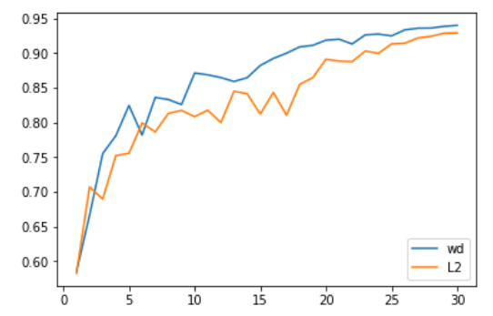

# AdamW

### Optimization Framework[5]

Definiton:

​	$w$ - parameters

​	$f(w)$ - objective function

​	$\alpha$ - initial learning rate

Pipeline:

​	1.	Figure out gradients: $g_t=\nabla f(w_t)$

​	2.	Figure out first-order and second-order momentum:
$$
m_t=\phi(g_1,g_2,g_3,...,g_t)\\
V_t=\psi(g_1,g_2,g_3,...,g_t)
$$
​	3.	Figure out descent gradients:$\eta_t=\alpha m_t/\sqrt{V_t}$

​	4.	Update parameters: $w_{t+1}=w_t-\eta_t$

## Optimizers

SGD:	$m_t=g_t;V_t=I$, so $\eta_t=\alpha g_t$

SGDM:	$m_t=\beta m_{t-1}+(1-\beta)g_t$	(Use moving average gradient as first order momentum)

AdaGrad:	$V_t=\Sigma^{t}_{i=1}g_i^2$ (Use historical gradient as second order momentum. Parameters may converge when they havn't achieve best performance)

AdaDelta/RMSProp:	$V_t=\beta V_{t-1}+(1-\beta)g_t^2$ (Avoid early stop)

Adam:
$$
m_t=\beta m_{t-1}+(1-\beta)g_t\\
V_t=\beta V_{t-1}+(1-\beta)g_t^2
$$
(Use moving average method for both first order and second order momentum)

## AdamW[2]

L2 regularization:
$$
final\_loss=loss+\frac{1}{2}w_d*all\_weights.pow(2).sum()
$$
Weight decay
$$
w=w-lr*w.grad-lr*w_d*w
$$
In SGD, L2 regularization is equivalant to weight decay:
$$
\begin{equation}
\begin{cases}
\frac{\partial final\_{loss}}{\partial w}=\frac{\partial loss}{\partial w}+w_d*w\\
\frac{\partial loss}{\partial w}=w.grad
\end{cases}
\end{equation}\\
w=w-lr*\frac{\partial final\_{loss}}{\partial w}=w-lr*w.grad-lr*w_d*w
$$
But things become different when it comes to Adam:

L2 Regularization(hitorical L2 regularization accumulated)
$$
m_t=\beta m_{t-1}+(1-\beta)(g_t+w_d*w)\\
$$
Weight decay(historical L2 regularization/weight decay will not be taken into account):
$$
m_t=\beta m_{t-1} +(1-\beta)g_t\\
w=w-lr*m_t-lr*w_d*w
$$
We needs weight decay rather than L2 regularization.(I found it has been fixed in pytorch[3])

## Take Away Notes

1. The suggestions that amsgrad are a poor “fix” are correct. We consistently found that amsgrad didn’t achieve any gain in accuracy (or other relevant metric) than plain Adam/AdamW.

2. Adam generally requires more regularization than SGD, so be sure to adjust your regularization hyper-parameters when switching from SGD to Adam.

3. In contrast to previous work, we see Adam getting about as good accuracy as SGD+Momentum on every CNN image problem we’ve tried it on, as long as it’s properly tuned, and it’s nearly always a bit faster too.

   ​																	—fast.ai

4. [4] proposed that switches from Adam to SGD when a triggering condition is satisfied to get better performance, but I did find people's responses, so AdamW may be the best choice.

## Reference

[1]http://www.fast.ai/2018/07/02/adam-weight-decay/

[2]Loshchilov, Ilya, and F. Hutter. "Fixing Weight Decay Regularization in Adam." (2018).

[3]https://pytorch.org/docs/stable/_modules/torch/optim/adam.html#Adam

[4]Keskar, Nitish Shirish, and R. Socher. "Improving Generalization Performance by Switching from Adam to SGD." (2017).

[5]https://zhuanlan.zhihu.com/p/32230623?utm_medium=social&utm_source=wechat_session