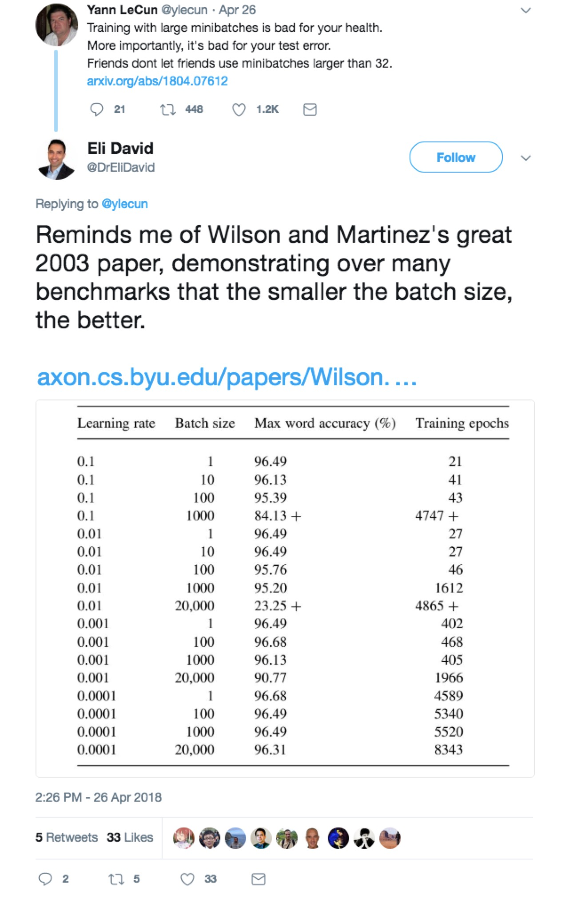
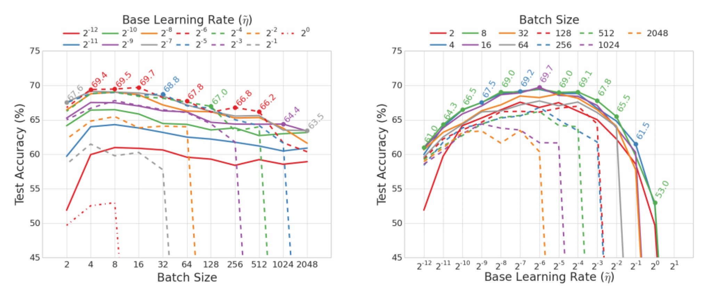
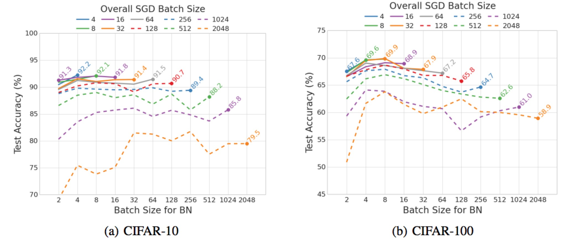

#Batch Normalization and Batch Size

##Main Idea

​	Nowadays, batch size is one of the most important super parameters in deep learning.




###Take Away Notes

```
Training with large minibatches is bad for your health.
Friends don‘t let friends use minibatches larger than 32.
														--LeCun
The presented results confirm that using small batch sizes achieves the best training stability and generalization performance, for a given computational cost, across a wide range of experiments. In all cases the best results have been obtained with batch sizes m = 32 or smaller, often as small as m = 2 or m = 4.
														--[1]

Details can be found in[1]. Additionally, Following LeCun on Twitter will be good for your health.
```

## Supplementary

1. Smaller batch size should be equipped with larger learning rate.



2. Batch Normalization is one of the most important technique for neural network boosting. However this is against our intuition that BN should benifit from estimating the normalization statistics over larger batches.==Evidence shows that batch size of BN smaller than batch size of SGD will be better==.$m=4,m=8$ may give the best results.



3. ==Don't Decay the Learning Rate, Increase the Batch Size==. Smaller batch size means larger variance, which results in noise and may help escape from saddle point. In contrast, larger batch size can make the model stable, so the parameters can converge. We can use small batch size in early stage, and increase the batch size to acheive best performance.[2]

## Reference

[1]Masters, Dominic, and C. Luschi. "Revisiting Small Batch Training for Deep Neural Networks." (2018).

[2 ]Nakamura, Taiga, T. Nakamura, and T. Nakamura. "Small Batch or Large Batch?: Gaussian Walk with Rebound Can Teach." *ACM SIGKDD International Conference on Knowledge Discovery and Data Mining*ACM, 2017:1275-1284.